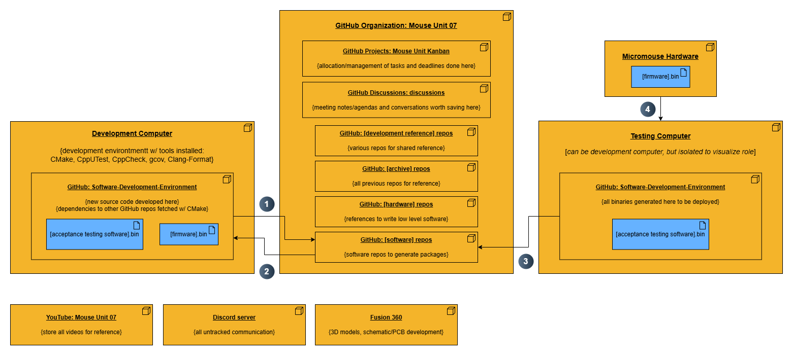

# Development Tools
Explanation of all tools used for development.

## Deployment/Dependency Diagram Between Tools

1. **Fetch source files** to begin development
2. **Fetch software packages** from JFrog Artifactory if needed for development
3. After development, **Jenkins responds to pull requests on GitHub**, and host PC's tools to apply regression tests and build new binaries
4. Jenkins fetches all packages currently on JFrog Artifactory to apply **regression tests** to notify engineer whether existing packages are happy w/ new changes 
5. **Jenkins stores new binaries on JFrog Artifactory** if source files are verified
6. Fetch micromouse testing software binary to **run acceptance tests** on micromouse hardware
7. **Deploy firmware** to micromouse over JTAG

## Do We Really Need All These Tools?
- These tools should be solutions to:
  - Manage development and integration of all software parts
  - Allow anyone to work on anything independently w/ no waiting for others or hardware
  - Avoid asking critical questions at the end when all development parts are coming together
  - Eliminating crunch time debug sessions
- We can change anything if we find that we're using the wrong approach

## GitHub Organizations
- Unifies everything related to development

- **Mouse Unit 07 Kanban**
  - Allows for smaller chunks of development to keep things moving in parallel
  - All tasks laid out and allocated as we each complete tasks
- **discussions repo**
  - Saves all useful communication we do (meeting, chatting) to look back at
  - We can safely forget things and know where to look back
- **[development reference] repos**
  - Unifies all intel, documentation, guides, etc to a single place for everyone to refer to
- **[archive] repos**
  - Outdated repos for reference
- **[hardware] repos**
  - Hardware schematics, layouts, design explanation documents, etc for reference and version control
- **[software] repos**
  - Software project repos

## Tools for Software Development
- **Docker**
  - Unifies all development tools and environment related changes to a single place
  - Docker container will be the superset of all needed tools and environment settings (to be separated as needed as container gets too bloated of tools and responsibilities)
  - Great for both development, and automated regression testing
  - ...Shelved until we migrate to a new MCU that has an associated Linux toolchain

- **Conan**
  - We want to split software up into packages to:
    - Allow anyone to develop any layer independently via TDD/mocks/fakes
    - Apply modularity to have software that's ready to adapt to change
  - Conan is a modern package manager that works w/ Jenkins, CMake, JFrog Artifactory

- **CMake**
  - Unified build configuration generator- configures and builds projects in place of an IDE
  - Allows for:
    - Easy swapping of implementation files- decouples build target control from source code
    - Automated builds over command line
    - Running unit tests w/ builds

- **CppUTest**
  - C/C++ unit testing harness

- **gcov**
  - Provides unit testing coverage

- **CppCheck**
  - Checks for memory leaks, unsafe code, etc

- **Clang-format**
  - Checks for formatting like tabs, spaces, etc

## External Tools

- **Jenkins**
  - Checks new source code pushed to GitHub w/ existing package artifacts to let an engineer know whether their new code works w/ all the other existing packages
  - Can run a Docker container identical to development Docker container to run the exact same procedure, but with all existing software packages

- **JFrog Artifactory**
  - Stores and centralizes build artifacts (package binaries) and Docker images
  - Also serves as version control
  - Popular build artifact repo choice that supports Conan
  - Nexus is also poular, but requires paid tier for Conan support

- **YouTube**
  - storage for all videos for reference 

- **Discord**
  - untracked communication

- **Fusion 360**
  - 3D model development
  - schematic/PCB development