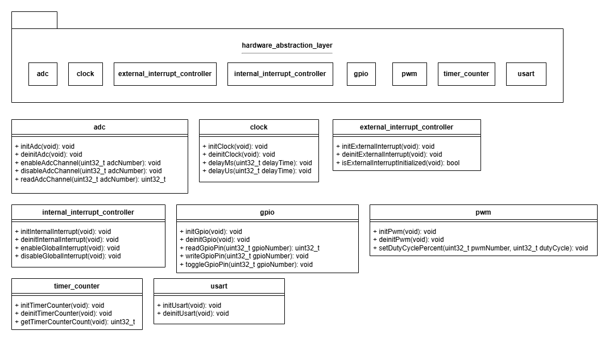
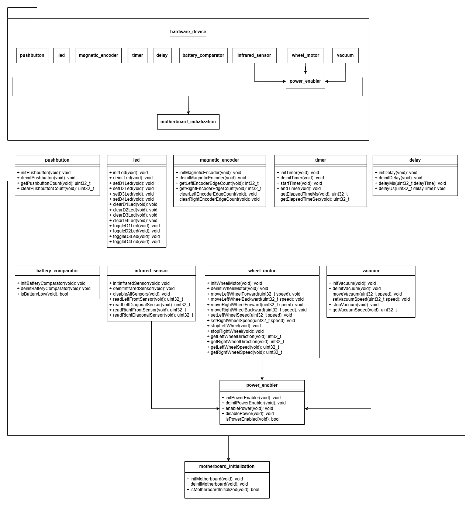
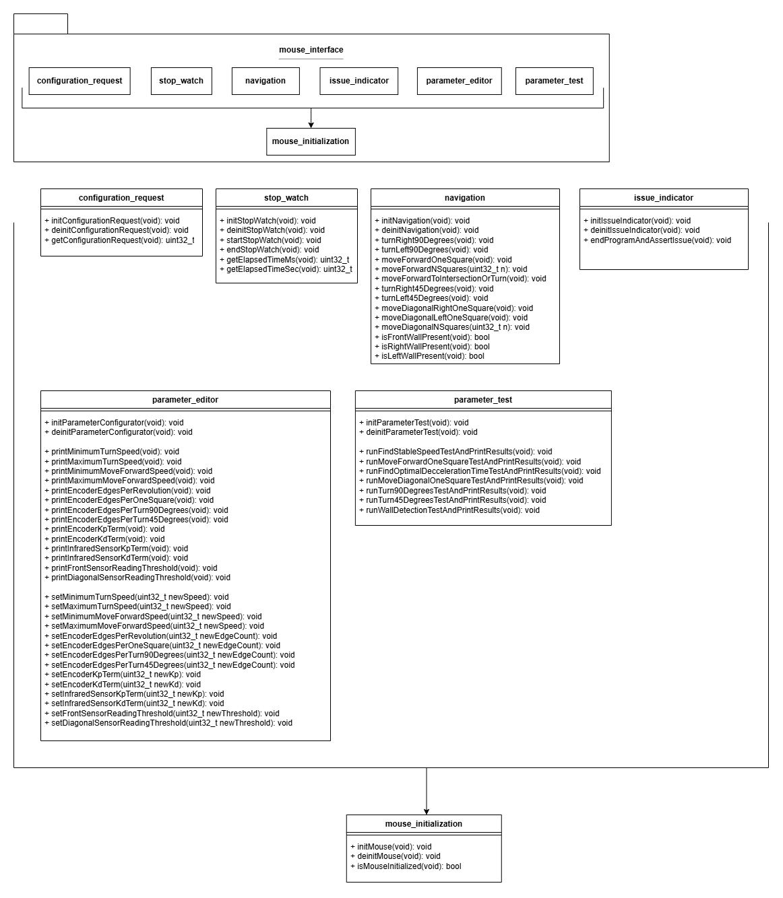

# Software Architecture
Below is a sketch of the software packages that make up the micromouse motherboard firmware.

## at32uc3l0256_drivers
- AT32UC3L0256 drivers wrapped to adhere to the hardware abstraction layer 
- This layer changes upon switching the motherboard MCU/processor

## hardware_abstraction_layer

- Middleware to abstract atomic hardware peripherals/components on a processor like adc, clock, gpio, etc
- Forces low level drivers to adhere to this HAL via dependency inversion
- This layer may expand to support new hardware components on the current and new processors, but does not have a reason to ever switch between implementation files dependeing on hardware targets 

## hardware_device

- Layer to define every external hardware component and its associated interface from the motherboard processor, as welll as a definition for the motherboard processor itself
- This layer changes upon switching external hardware devices on the motherboard, including the processor itself

## mouse_interface

- Interface to control the micromouse for movement and control
- Also provides interfaces for calibration and testing to a particular maze

## maze_solving_algorithm
- Maze solving interface to solve a micromouse maze

## command_line_interface
- Console interface for calibration and testing

## mouse_motherboard
- Final package to be deployed to micromouse hardware
- Includes a minimal firmware version module to print the version of all packages that make up the final binary, provided by the build configuration system

## parameter_generator
- C++ software to simulate a micromouse in a virtual maze to generate optimal parameters