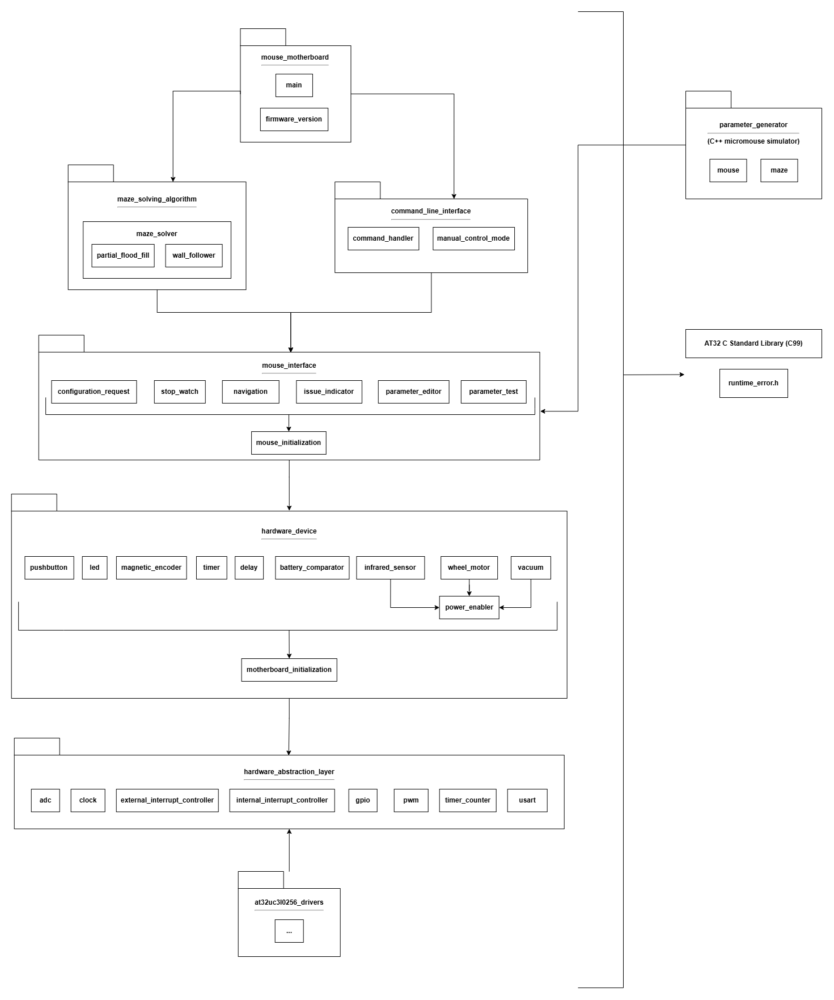

# Development Tools
Below is a sketch of the software packages that make up the micromouse motherboard firmware.

**at32uc3l0256_drivers**
- AT32UC3L0256 drivers wrapped to adhere to the hardware abstraction layer 
- This layer changes upon switching the motherboard MCU/processor

**hardware_abstraction_layer**
- Middleware to abstract atomic hardware components on a processor like adc, clock, gpio, etc
- Forces low level drivers to adhere to this HAL via dependency inversion
- This layer may expand to support new hardware components on the current and new processors, but does not have a reason to ever switch between implementation files dependeing on hardware targets 

**hardware_interfaces**
- Interface for the motherboard processor to interface w/ individual hardware devices on the micromouse
- This layer changes upon switching external hardware devices on the motherboard

**mouse_interfaces**
- Interface to control the micromouse for movement and control

**maze_solving_algorithm**
- Maze solving interface to solve a micromouse maze

**command_line_interface**
- Console interface for troubleshooting

**mouse_motherboard**
- Final package to be deployed to micromouse hardware